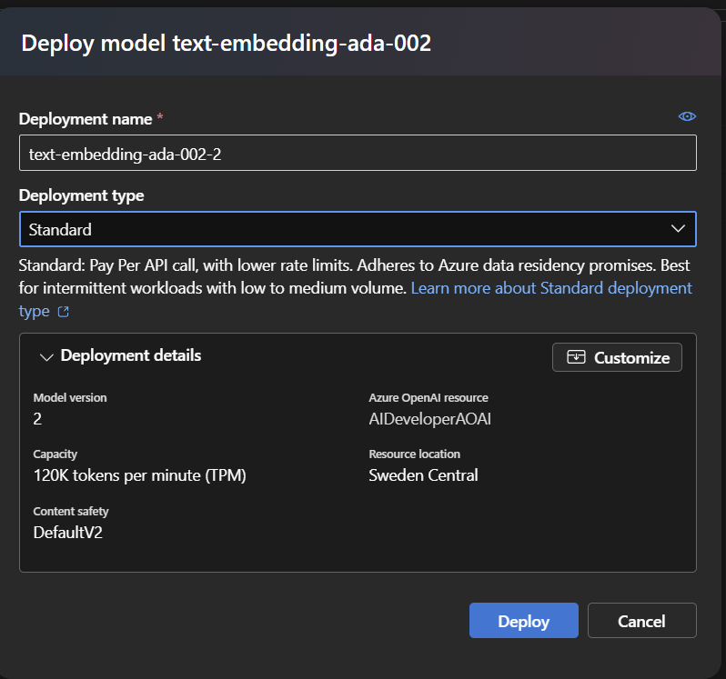

# Infrastructure

## Setup Azure OpenAI

1. Navigate to  [Azure Open AI Studio](https://oai.azure.com) and login with your Azure credentials
2. Deploy a ***Standard GPT3.5 Turbo*** model (version **0613** or greater) in a region that can host GTP-3.5 and GPT-4o

## Deploy Azure AI Search

We will create a Semantic Search Plugin that utilizes an Azure AI Search Index to retrieve information from the Contoso Handbook document. The purpose of the plugin is to enable the AI Model to answer questions about your own documents. We achieve this by converting the user's query into an embedding using a Text Embedding model. The embedding is then used to search the AI Search Index for the most relevant information.

1. In the [Azure Portal](https://portal.azure.com/) search for ```AI Search``` and select **Create**.
    1. Create it in the **same resource group and location as your AI Models**.
    1. Change the pricing tier to **Basic**.
    1. Leave everything else as default, then click **Review + create**.

1. Once the AI Search resource is created, navigate to the resource.
    1. Grab the **URL** from the Overview section.
    1. Grab the **Key** from the Keys section.
    1. Add these values to the **appsettings.json** file in the reference application. You will need these values later when configuring AI Search.

    ```json
      "AI_SEARCH_URL": "Replace with your AI Search URI",
      "AI_SEARCH_KEY": "Replace with your AI Search API Key"
    ```

    :bulb: The AI Search URL and Key will be used to configure the AI Search Connector in the Semantic Search Plugin.

### Deploy Storage Account with CORS enabled

1. In the [Azure Portal](https://portal.azure.com/) search for ```Storage Account``` and select **Create**.
    1. Create it in the **same resource group and location as your AI Models**.
    1. Leave everything as default, then click **Review + create**.
1. Once the Storage Account is created, navigate to the resource. Reference this screenshot for the CORS settings below.
    1. Under the **Settings** section, click on **Resource sharing (CORS)**.
    1. Add 2 rows with the following values:
        1. Row 1:
            * Allowed origins: ```https://documentintelligence.ai.azure.com```
            * Allowed methods: ```Select All```
            * Allowed headers: ```*```
            * Exposed headers: ```*```
            * Max age: ```120```
        1. Row 2:
            * Allowed origins: ```https://oai.azure.com```
            * Allowed methods: ```GET, POST, OPTIONS, and PUT```
            * Allowed headers: ```*```
            * Exposed headers: ```*```
            * Max age: ```120```

    1. Click **Save**.

    

### Use AI Studio to deploy a Text Embedding model

1. Using [Azure AI Studio](https://ai.azure.com/resource/deployments), deploy a *Standard* **text-embedding-ada-002** model in the same deployment as your previous GPT3.5 Turbo model. Once deployed, add the **Embedding Deployment Model Name** as a new setting to the **appsettings.json** file in the reference application. You will need this value later when configuring the Semantic Search Plugin.

    

2. Add the **Embedding Deployment Model Name** to the **appsettings.json** file in the reference application.

    ```json
    "EMBEDDINGS_DEPLOYMODEL": "text-embedding-ada-002"
    ```

    :bulb: This model will be used to translate your documents and queries into embeddings

### Import documents

1. In Azure OpenAI Studio click on Chat -> Add Your Data -> Add Data Source

    

1. Select Data Source = ```Upload Files```.
1. Select the existing Blob Storage resource you created earlier.
1. Click **Turn on CORS** if prompted.
1. Choose the **AI Search Resource** setup in the previous step.
1. For the Index Name use ```employeehandbook```
    > :bulb: The AI Search Index Name will be needed by the reference application

    

1. Check **Add Vector Search**
1. Select the **text-embedding-ada-002** model created previously
1. Click Next

    

1. Upload the ```employee_handbook.pdf``` from the **.\data** directory and **click Next**
1. Set the Search type to **Vector** and the Chunk Size to **1024** then **click Next**
    > :bulb: Chunk size refers to how much text is grouped together into a single segment or "chunk" before creating an embedding. When processing large documents, the text is often divided into smaller chunks to create embeddings for each segment. The chunk size determines how much text is included in each embedding.
    >
    > Choosing the right chunk size is important: if chunks are too large, important details might get lost or diluted in the embedding; if too small, the system might miss out on essential context. The chunk size thus impacts the accuracy and relevance of the information retrieved and subsequently used in generating responses

    

2. Set the Resource Authentication Type to **API Key**

    

    :repeat: Click **Next** and wait for the import to finish

## Next Steps

[Create a Semantic Search Plugin to query the AI Search Index](./SemanticSearchPlugin.md)
